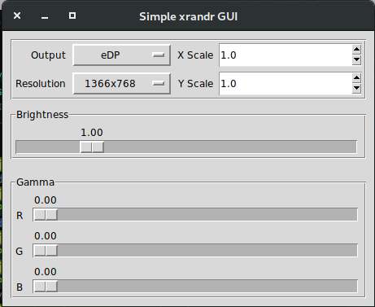

#XRANDRGUI - A SIMPLE PYTHON GUI FOR XRANDR (alpha)

***
This is a simple program that is a gui for some of the simple xrandr functions. It is written in python and uses the tkinter for the gui.
creation.

Jonathan Oxborrow
